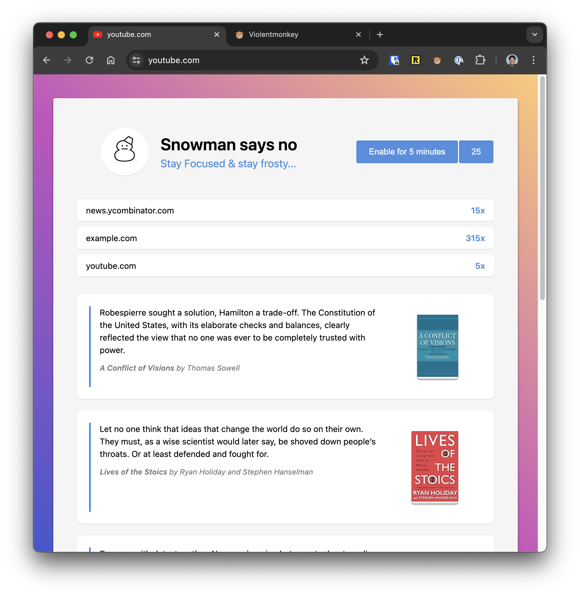

# Snowman Fokus

A simple yet effective Greasemonkey-compatible script that allows you to quickly add distracting websites to a list and have the browser block them for you. I use [Violentmonkey](https://violentmonkey.github.io/), and it's the only one I've tested. If you have a Readwise account, add your API key, and you'll get random quotes instead. Much better content!



Use it as is, or as a starting point for your own ADHD hacking.

## Install

1. Install [Violentmonkey](https://violentmonkey.github.io/)
2. Add new script -> From URL: ```https://raw.githubusercontent.com/tobi/snowman-fokus/main/fokus.js```
3. Enable the script and add sites to block

## Why Snowman?

I honestly have no idea. I've had versions of this as extensions for about 20 years now, and it's always been a snowman that told me "no". So I'm calling it tradition now and trying not to think too hard about it. Actually, I think it's probably because the snowman Unicode character was the closest thing to an emoji that we had back in those days, and who wants to bundle an image with an extension? :-)
